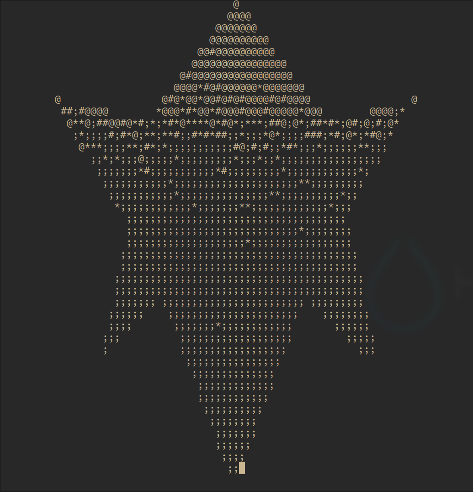

# Fall Hack 2023 Turning Over a New Leaf

## Project description
* This the a TUI software, which is developed under modern C++17. It repersentes a huge 3D leaf, which is clickable in order to rotate 180 degrees. (Turning)

## Technical detail
* We have implemented a few modulers. The projector, rotater, shader and rasterizer. Inspired by linear algebra courses MATH232.
* There are also some utils modules, such as input interface, which was designed strictly under the signal design pattern, and threadsafe.

## Screenshot
* 

## File structure
TOaNL  
  ├── CMakeLists.txt  
  ├── LICENSE   -- MIT License  
  ├── README.md -- README.md  
  ├── debug     -- debug files
  ├── etc  
  ├── include   -- header files  
  ├── src       -- source code  
  └── test      -- test files (empty)

## Pre-requisite
1. Arch Linux x86_64
2. CMake version 3.27.6
3. NCurses

## Install make tool and libraries
* For apt
```bash
sudo apt-get -y install cmake
sudo apt-get install libncurses-dev
```
* For pacman
```bash
sudo pacman -S cmake
sudo pacman -S ncurses
```

## Config and Compile
```bash
cmake -S . -B build; cmake --build build
```

## Execution
* Replace CMAKE_BINARY_DIR with actual binary directory.
```bash
${CMAKE_BINARY_DIR}/bin/main
```

## Usage
* Left click: rotate the leaf for 180 degree
* Ctrl+C: Exit the program

## Participant names and contact information
* name: Jingxuan Cao id: 301540981 email: jca521@sfu.ca
* name: Shawn Oborne id: 301544510 email: smo7@sfu.ca
* name: Siu Yu Chau id: 301604828 email: syc54@sfu.ca

## Github repository and video tutorial
Github repository: https://github.com/dousbao/TOaNL
Video tutorial: tbd

## License
[link](LICENSE)
